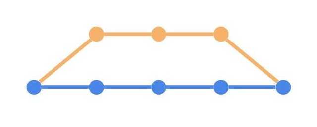

# GIT  
- ### **REMOTE 서버?**
    GIT은 리누스가 만든 분산 버전 관리 시스템이다.
    ` GIT HUB, GIT LAB, Bitbucket ` 원격 서버에 저장할 수 있도록 저장소를 제공해주는 대표적인 업체인 것이다. 즉, 깃이라는 시스템은 리누스가 개발했지만 그 시스템이 사용하는 레포지토리는 여러 선택지가 있다.   
    한 개의 리모트 서버만 사용해야 한다는 법은 없다. 다만 웬만한 경우라면 리모트 서버는 하나이다.
    이 때 리모트서버의 이름을 정해줘야 하는데, 보통 ` origin ` 으로 짓는 것이 일반적이다.  
    

- ### **레포지토리(REPOSITORY)**
    리모트 서버내에서 구분되는 저장소로서 보통 프로젝트 단위로 나눈다.
    레포지토리를 클론받을 때는 해당 url 주소로 받는다.
    레포지토리의 이름은 해당 url 주소 마지막에 .git 확장자를 가지는 방식으로 표현된다.
    ```git
    https://github.com/user/repository.git
    ```

- ### **브랜치(BRANCH)**
    작업을 독립적으로 진행하기 위한 개념이다. 레포지토리를 생성하면 기본적으로 메인 브런치가 생기고 이 후 개발하는 기능 버그 픽스 등에 따라 브랜치를 새로 생성하고 새로 생성한 브런치에서 작업을 독립적으로 진행할 수 있다.
- ### **분산 버전 관리 시스템**
    리모트 서버에 있는 소스를 수정하기 위해서는 `CLONE(클론)` 을 거쳐야 한다.  
    ` CLONE(클론) ` 이란 리모트에서 모든 소스를 복사하여 사용자 컴퓨터로 받아오는 것

    이후 GIT은 로컬 파일의 변경 사항을 추적하고 있다가 수정이 생기면 변경 사항을 감지한다.  
    사용자는 리모트 서버에 반영하고 싶은 사항을 선택하여 리모트 서버에 업로드 한다.


- ### **PULL 과 FETCH의 차이점**
    ` PULL ` 은 리모트 서버에서 최신 소스를 가져와 로컬 저장소에 ` 병합(MERGE) ` 을 하는 명령어이다.  
    ` FETCH ` 도 ` PULL `과 비슷하게 리모트 서버의 소스를 가져온다. ***하지만 ` 병합 ` 은 이뤄지지 않는다.***  
    그래서 ' FTECH ' 는 주로 로컬 소스와 리모트 소스간의 변경 사항을 미리 비교해보고 싶을 때 사용한다.


## **MERGE(병합)**
각각의 브랜치에서 각자의 기능을 맡아 작업하다보면 언젠가는 이 브랜치들을 합쳐줘야 한다.  
이 때 브랜치를 합치는 행위를 ` MERGE(병합) ` 이라고 칭한다. 깃에서는 3개의 방식으로 병합 기능을 제공한다.  

1. ### **Merge**
    가장 기본적은 브랜치 병합이다. 타겟 브랜치에 병합 브랜치의 변경 사항을 모두 반영하며 ` 머지 커밋(Merge commit) `을 남긴다.
    >
    
2. ### **Merge squash**
    병합시에 --squash 옵션을 줄 수 있다.
    일반 머지는 병합 브랜치의 모든 커밋 기록이 남아 있는 상태에서 타겟 브랜치로 병합이 된다. *** 하지만 머지 스쿼시는 병합 브랜치의 커밋을 하나로 모아 하나의 커밋으로 합치고 타겟 브랜치에 병합을 한다. ***

3. ### **Rebase**
    ` 리베이스(Rebase) `도 ` 머지 ` 와 마찬가지로 합치는 방식이다.
    다만, ` 머지 `는 두 개의 브랜치를 하나로 합치는 기능이기에 A 브런치의 변경 사항 전부(COMMIT기록)를 B 브랜치에 푸쉬하는 것과 동일하다.   
    그렇기에 항상 ` 머지 커밋 (Merge commit) ` 이 남게 된다. ` 머지 커밋 ` 에는 장단이 있다.  
    장점 : 이 브랜치가 언제 머지 되었는지 알기 쉽다.  
    단점 : 브랜치가 많아 질 경우 커밋 로그가 머지 커밋으로 너무 난잡해진다.

    그러나 리베이스는 단순히 합치는 것이 아니라 브랜치의 베이스를 변경하는 것이다. 말 그대로 ` Rebase `  한다는 의미이다.  
    즉, 병합 브랜치의 변경 사항(commit 기록)들이 마치 타겟 브랜치의 변경 사항이었던 것처럼 히스토리가 기록된다.

            

    ><center></center>


    위 커밋 히스토리에서는 Feature 브랜치를 Master 브랜치로 Rebase 했다.  
    그 결과로 Feature 브랜치 이후에 Master 브랜치에 커밋된 변경 사항들이 Feature 브랜치의 가장 최근 변경 사항으로 커밋 히스토리가 남았다.  
    ***다만***, 
    본인은 Rebase가 이루어져 Feature 브랜치가 히스토리에 남아있는 Master 브랜치와 작업하지만, **협업하는 다른 사람들은 Feature 브랜치가 히스토리에 있는 Master 브랜치가 아닌 Rebase 전 master 브랜치와 함께 일하고 있을 수도 있다.**


참고:https://evan-moon.github.io/2019/07/28/git-tutorial-advanced/