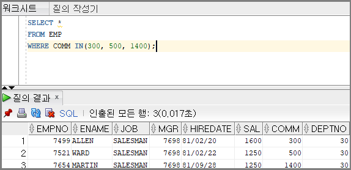

# 오라클 함수  
- ## **decode**
    IF ELSE 와 비슷한 기능을 수행
    ```sql
    decode(gender, 'm' , '남자' , 'f', '여자', '기타') 
            컬럼   조건1  결과1    조건2 결과2   ELSE
    ```
    else 부분은 생략이 가능하다 (null을 리턴)


    EX)
    ```SQL
    --주민등록번호(MY_NUM)이(가) 1또는3으로 시작하면 남자 아니면 여자
    SELECT 
    DECODE(SUBSTRING(MY_NUM,0,1),1||3,'남','여') AS GENDER
    FROM
    EMP_TABLE
    ```
*오라클에만 사용되는 함수이다.

  ---   
  - ## **IN , NOT IN**
    ```SQL
    column_name IN(A,B,C)
    ```
    특정 필드의 값이 A,B,C 이 셋 중에 어느 하나만 만족하더라도 출력하도록 하는 연산자  

      
    위 쿼리는 커미션(comm)이 300이거나 500이거나 1400인 사원을 검색하는 예제.

    이렇게 or절을 여러 개 사용하지 않고 쿼리 작성이 가능하다.