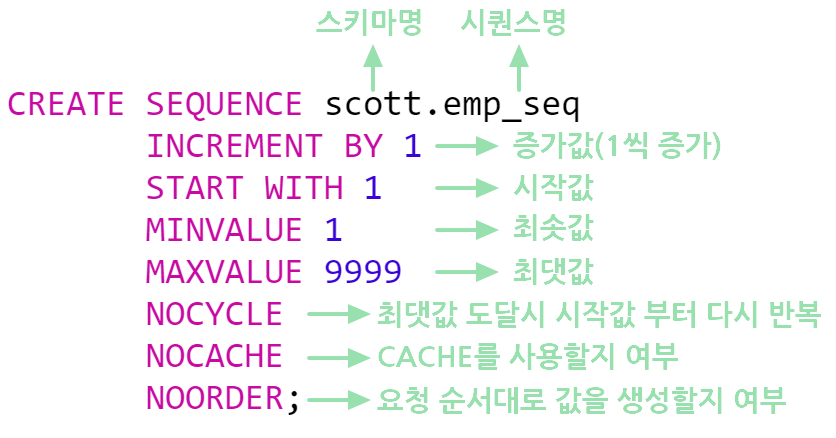

# **오라클 함수**
- ## **DECODE**
    IF ELSE 와 비슷한 기능을 수행
    ```sql
    decode(gender, 'm' , '남자' , 'f', '여자', '기타') 
            컬럼   조건1  결과1    조건2 결과2   ELSE
    ```
    else 부분은 생략이 가능하다 (null을 리턴)


    EX)
    ```SQL
    --주민등록번호(MY_NUM)이(가) 1또는3으로 시작하면 남자 아니면 여자
    SELECT 
    DECODE(SUBSTRING(MY_NUM,0,1),1||3,'남','여') AS GENDER
    FROM
    EMP_TABLE
    ```
*오라클에만 사용되는 함수이다.

  ---   
  - ## **IN , NOT IN**  
  
    ```SQL
    column_name IN(A,B,C)
    ```
    특정 필드의 값이 A,B,C 이 셋 중에 어느 하나만 만족하더라도 출력하도록 하는 연산자  

      
    위 쿼리는 커미션(comm)이 300이거나 500이거나 1400인 사원을 검색하는 예제.

    이렇게 or절을 여러 개 사용하지 않고 쿼리 작성이 가능하다.  
  ---
- ## **시퀀스(Sequense)**
  오라클에서는 mysql과는 다르게 auto incresement를 지원하지 않음. 따라서 ` MAX(칼럼) + 1 `또는 `시퀀스`를 사용하여 일련번호를 부여한다.


  

  - INCREMENT BY : 시퀀스 실행 시 증가시킬 값
  - START WITH : 시퀀스의 시작값이다. (MINVALUE과 같거나 커야 한다)
  - MINVALUE : 시퀀스가 시작되는 최솟값이다.
  - MAXVALUE : 시퀀스가 끝나는 최댓값이다.
  - NOCYCLE | CYCLE : NOCYCLE (반복안함), CYCLE(시퀀스의 최댓값에 도달 시 최솟값 1부터 다시시작,기본 값은 NOCYCLE)
  - NOCACHE | CACHE : NOCACHE(사용안함), CACHE(메모리에 미리 값을 할당해 놓아서(캐싱) 속도가 빠르며, 동시 사용자가 많을 경우 유리)
  - NOORDER | ORDER : NOORDER(사용안함), ORDER(병렬서버를 사용할 경우에 요청 순서에 따라 **정확**하게 시퀀스 값을 생성을 위함. 조금의 시스템 부하가 있음,   기본 값은 NOORDER)  
  
  <br>  

  Ex) 시퀀스 생성
  ```sql
  CREATE SEQUENCE order_seq_num
    MINVALUE 400
    MAXVALUE 10000000
    NOCYCLE
    INCREMENT BY 1
  ```
  위 코드는 시퀀스는 400부터 시작하여 10000000까지 1 씩 증가한다. 10000000에 증가하면 더 이상 증가하지 않는다.  
  <br>
  
  EX) CHACHE를 사용할 경우  
  ```SQL
  CACHE
  또는
  CACHE 100
  ```
  CHACHE 값을 입력하지 않으면 기본값은 20이다. 위 코드에서는 100의 값 만큼 시퀀스를 미리 생성해 놓는다.  
  CHCHE를 사용할 경우 미리 시퀀스를 캐싱하여 (미리 할당하여) 속도가 빠르게 시퀀스 값을 가져온다. 사용자가 많을 경우에 유리하다.

  <br>


  ### **시퀀스 사용법**
    ```SQL
    CREATE SEQUENCE order_seq_num
  MINVALUE 400
  MAXVALUE 10000000
  NOCYCLE
  INCREMENT BY 1
    <-- 400부터 시작하여 10000000까지 1 씩 증가하는 시퀀스 생성 -->


    SELECT order_seq_num.NEXTVAL
    FROM dual <-- 결과 값은 nextval 400-->

    INSERT INTO (order_id,order_name,order_date,order_price)
          VALUES(order_seq_num.NEXTVAL , "book", 2022-07-07, 20000);
    ```
    위 코드를 실행하면 insert가 실행될 때 마다 시퀀스는 400에서 1씩 증가하게 되어 insert시에 시퀀스 값이 삽입된다.  

참고:https://gent.tistory.com/393 , https://offbyone.tistory.com/239


## Oracle table 만들기

```sql
create table 테이블이름(
컬럼명 데이터타입 조건,
칼럼명 데이터타입 조건,
...

)
```